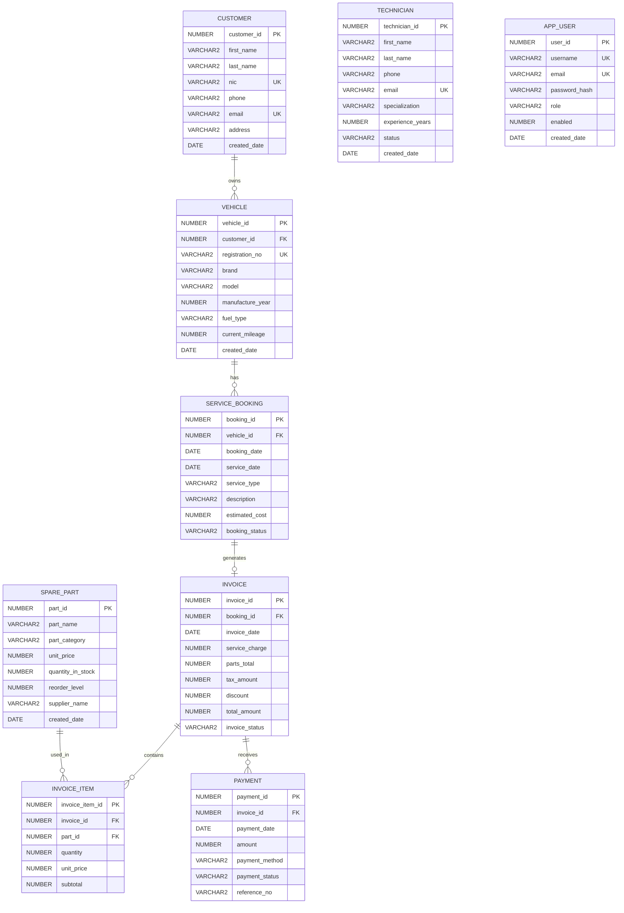

# AutoCare Vehicle Service & Maintenance Management System

## Oracle Relational Database ER Diagram

## Relationships

- One customer can own many vehicles.
- One vehicle can have many service bookings.
- One service booking can have zero or one invoice.
- One invoice can contain many invoice items.
- One spare part can appear in many invoice items.
- One invoice can have many payments.
- `TECHNICIAN` is referenced logically by MongoDB job-card documents.
- `APP_USER` is used for authentication and role-based access control.